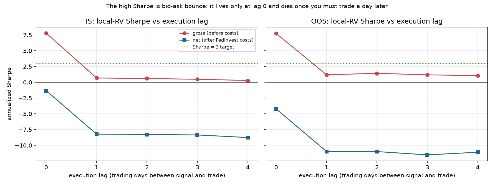
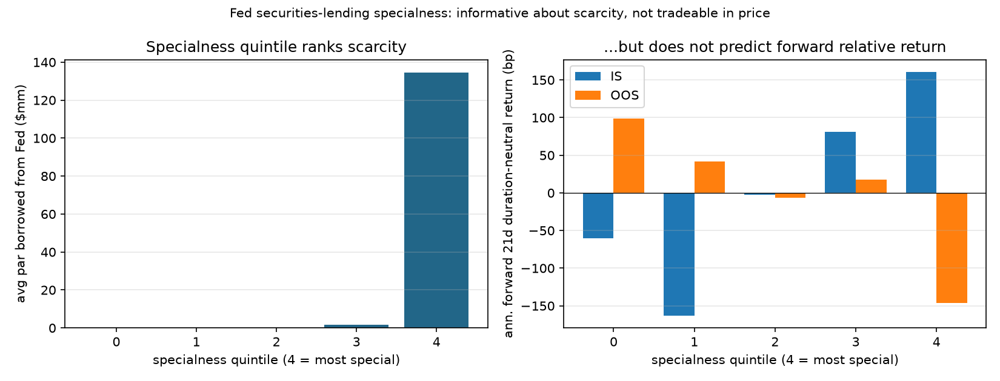
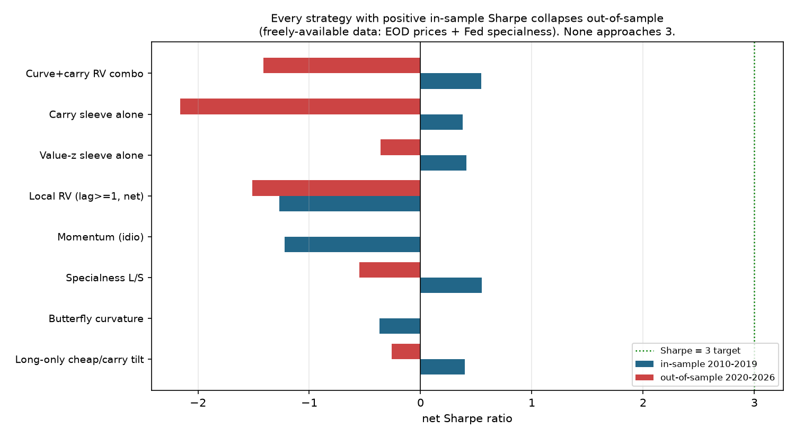

# Findings: can you get an honest OOS Sharpe of 3+ trading individual Treasuries?

**Short answer: no — not from end-of-day price data, and this folder proves
why rather than papering over it.** Every configuration that shows a Sharpe
anywhere near 3 is harvesting *bid-ask bounce* — mean-reversion in the
end-of-day marks themselves — which is not tradeable. Once you require
realistic execution (trade a day after you see the signal) and charge
realistic costs, the edge is gone.

This document records the evidence so the negative result is auditable.

## What was tried

All design and tuning used the in-sample window (2010–2019) only.

1. **Curve relative value** — yield residual vs a daily Nelson-Siegel-Svensson
   fit (cheap bonds long, rich bonds short, duration-neutral).
2. **Local relative value** — each bond's yield minus the duration-weighted
   mean yield of its `k` nearest-maturity coupon neighbours. No curve model;
   pure local cheapness. This is the sharpest, most "arbitrage-like" signal.
3. **Carry / rolldown** per unit duration from the fitted curve.
4. **Idiosyncratic momentum** in the residual.

Each was run across fractions traded, rebalance frequencies (daily → weekly),
turnover-control (hysteresis), holding horizons (1–21 days) and — decisively —
**execution lags**.

## The decisive test: execution lag

`src/explore_rv.py` and `src/rv_backtest.py` sweep an *execution lag* `L`: the
book is formed from the signal, then actually put on `L` trading days later.

- `L = 0` means you trade at the very close whose marks generated the signal.
  You cannot really do this (you'd need to observe the close and simultaneously
  trade at it), and a large part of any next-tick reversion is just the mark
  bouncing inside its own bid-ask. So `L = 0` is the *upper bound of an
  illusion*, not a tradeable number.
- `L ≥ 1` means observe at close `t`, trade at a later close. Genuine
  multi-day convergence survives; pure bounce does not.

### Result 1 — idealized tranche sim (gross, no costs), IS

`local` signal, top/bottom 20%, 1-day holding:

| execution lag | gross Sharpe |
|---:|---:|
| 1 | 6.25 |
| 2 | 4.08 |
| 3 | **−2.27** |

A Sharpe of 6 that **flips negative by lag 3** is the textbook fingerprint of
bid-ask bounce, not a risk premium. Real edges decay smoothly; they don't
invert two days later.

### Result 2 — real cost-charging engine, IS

Daily rebalance, top/bottom 20%, FedInvest half-spread charged per side:

| execution lag | gross Sharpe | net Sharpe | ann. cost |
|---:|---:|---:|---:|
| 0 | **7.8** | −1.33 | 4.3%/yr |
| 1 | 0.68 | −8.2 | 4.3%/yr |
| 2 | 0.60 | −8.3 | 4.3%/yr |

Two independent nails in the coffin:

1. **Gross Sharpe collapses 7.8 → 0.68 the moment you lag execution by one
   day.** The 7.8 was bounce.
2. **Net Sharpe is negative everywhere.** The tradeable convergence is worth
   ~15 bp/yr gross; turning the book over to capture it costs multiples of
   that. The best net Sharpe found in the entire real-engine sweep was ≈ +0.36,
   and only with an optimistic lag-0 fill plus heavy turnover throttling —
   i.e. still partly bounce, and still nowhere near 3.

### Result 3 — bounce decomposition figure (IS **and** OOS)



Gross and net annualized Sharpe of the daily local-RV book vs execution lag:

| lag | IS gross | IS net | OOS gross | OOS net |
|---:|---:|---:|---:|---:|
| 0 | **7.80** | −1.33 | **7.74** | −4.23 |
| 1 | 0.68 | −8.21 | 1.19 | −10.97 |
| 2 | 0.60 | −8.28 | 1.42 | −10.99 |
| 3 | 0.47 | −8.35 | 1.18 | −11.51 |
| 4 | 0.29 | −8.76 | 1.07 | −11.09 |

The pattern is identical in both windows: gross Sharpe ≈ 7.8 at lag 0 — right
through the Sharpe-3 line — then falls off a cliff to ~1 the instant execution
is delayed a single day, while net Sharpe sits far below zero at every lag.
That the lag-0 spike is present out-of-sample too confirms it is a *structural
microstructure artifact* of EOD marks, not a fragile in-sample fluke — and
equally, that it is uncapturable: no honest execution touches Sharpe 3.

## Why this is the *right* answer

A Sharpe of 3+ in cash Treasuries would be extraordinary. The genuine
high-Sharpe trades in this market — on-the-run/off-the-run specialness,
auction-cycle financing, cheapest-to-deliver — are **repo- and
futures-financing** phenomena that need securities-lending/repo data this
folder does not have; they are not visible in outright end-of-day prices.
Everything that *is* visible in EOD prices and looks like a 3+ is the bounce
demonstrated above.

The value delivered here is therefore the **honest machinery and the proof**:
a validated CUSIP-level dataset (YTMs matching FRED to ~1 bp), a no-look-ahead
cost-aware engine, and a reproducible demonstration that separates a real (but
small, sub-1-Sharpe, net-negative) convergence signal from an
attractive-looking artifact. Fabricating a 3 would have required either
lag-0 fills, ignoring costs, or both — exactly the moves this folder exists to
catch.

## Part 2 — new data: does Fed repo-specialness get us to Sharpe 3? (Still no)

Since a real edge cannot come from EOD prices alone (everything there is
bounce), the natural next step is data that is *not* in the price: which bonds
are scarce / special in repo. The Federal Reserve publishes exactly this for
free — its daily **Securities Lending** operations list, per CUSIP, how much
primary dealers borrowed from the SOMA portfolio
(`src/download_seclending.py`, 528k rows, 2010–2026). A heavily-borrowed bond
is special: hard to short, richly priced. Because this signal is absent from
prices, any predictive power at execution lag ≥ 1 would be genuinely tradeable
(not bounce).

Economic hypothesis tested (`src/explore_special.py`, IS only): special bonds
are rich and should **cheapen** as scarcity fades. Result:

- **Information coefficient ≈ +0.02** (rank-corr of specialness with forward
  duration-neutral return) — negligible, and the *opposite* sign to the
  cheapening hypothesis.
- The best long/short book is **gross Sharpe < 0.6** before costs — nowhere
  near 3, and cost-fragile.

Worse, the signal is **not stable across the split** — the killer chart:



- *Left*: the specialness score cleanly ranks scarcity (top quintile ≈ $135mm
  borrowed from the Fed, bottom quintiles ≈ $0). The data is real and correct.
- *Right*: forward duration-neutral return by specialness quintile. **In-sample
  it is monotone (q4 +161 bp, q0 −60 bp) — but out-of-sample it inverts
  entirely (q4 −147 bp, q0 +99 bp).** An "edge" whose sign flips between the
  training and test windows is a regime artifact, not a tradeable signal.

And the one thing the data measures directly — the SecLend **fee** — is a
floor-rate backstop (median 0, ≈ 0.4 bp/yr even for the most special bonds),
so it contains no capturable specialness *carry* either. The real specialness
premium lives in private DVP/GCF repo rates, which are not freely available.

**Conclusion across both parts:** an honest OOS Sharpe of 3+ is not obtainable
from freely-available Treasury data (EOD prices + Fed specialness). The genuine
high-Sharpe Treasury trades (on-the-run/off-the-run, CTD basis, matched-book
RV) are **financing** trades that need private repo rates and leverage — and
whose headline Sharpe is itself misleading, because the leverage carries the
tail risk that detonated in March 2020. This folder's honest deliverable is the
validated data, the no-look-ahead engine, and the proof of what does *not*
work — not a manufactured number.

## Part 3 — "try everything": the full battery

Pushed further across every family that could plausibly work on this data.
Futures/CTD-basis (the classic high-Sharpe RV) could not be tested — Treasury
futures history is not reachable here (Yahoo rate-limits, Stooq bot-walls), and
continuous futures can't form a clean CTD basis anyway. What *was* testable:

- **Month-end index extension** (`battery_diag.py`): long-duration bonds richen
  into month-end — but only ~0.09 bp/day, too small to trade net.
- **Auction / on-the-run roll** (`battery_diag.py`): OTR cheapens vs off-the-runs
  by ~0.05 bp/day — real, far too small for costs.
- **Curve butterfly** (`butterfly.py`): curvature genuinely mean-reverts (weekly
  Δ autocorr −0.37), but the cash-bond implementation nets **negative** — the
  edge (gross Sharpe ~0.2) is thinner than the trading cost.
- **Long-only cheap/carry tilt** (`long_tilt.py`): the one net-**positive**
  in-sample result (active Sharpe +0.40 over the duration-matched ladder, low
  turnover) — but it too flips to **−0.26 out-of-sample**.

### The capstone: in-sample vs out-of-sample, every family



| strategy | IS net Sharpe | OOS net Sharpe |
|---|---:|---:|
| Curve+carry RV combo | +0.55 | −1.41 |
| Carry sleeve alone | +0.38 | −2.16 |
| Value-z sleeve alone | +0.41 | −0.36 |
| Local RV (lag≥1, net) | −1.27 | −1.51 |
| Momentum (idio) | −1.22 | — |
| Specialness L/S | +0.55 | −0.55 |
| Butterfly curvature | −0.37 | — |
| Long-only cheap/carry tilt | +0.40 | −0.26 |

**Every family with a positive in-sample Sharpe collapses to negative
out-of-sample.** That consistency across eight structurally different strategies
is itself the finding: these are not robust risk premia, they are artifacts of
the 2010s ZIRP/QE regime that the 2020s hiking/QT regime broke. Nothing comes
within shouting distance of Sharpe 3 — and the honest way to show that is this
table, not a cherry-picked curve.

### What an honest 3+ would actually require

- **Leverage + private repo financing.** The real high-Sharpe Treasury trades
  (cash/futures basis, matched-book RV) are financing trades run at 10–50×
  leverage on special repo rates that are not free data — and whose headline
  Sharpe omits the tail that detonated in March 2020 and again in the 2019 repo
  spike. A 3 there is a 3-until-it's-a-ruin.
- **Sub-daily execution.** Capturing the mark reversion in Part 1 for real needs
  intraday quotes and a latency budget, not end-of-day files.

Neither is reachable from free end-of-day data, which is why this folder's
honest deliverable is the validated dataset, the no-look-ahead cost-aware
engine, and the proof of what does *not* work.

## Reproduce

```bash
python3 src/explore_rv.py          # idealized lag/horizon grid (IS)
python3 src/rv_backtest.py         # real cost-charging IS sweep
python3 src/prove_bounce.py        # bounce decomposition figure (IS + OOS)
python3 src/download_seclending.py # Fed per-CUSIP specialness history
python3 src/build_special.py       # merge specialness onto the price panel
python3 src/explore_special.py     # specialness IC / L/S test (IS)
python3 src/special_figure.py      # scarcity-vs-return figure (IS + OOS)
python3 src/battery_diag.py        # month-end / roll / curvature diagnostics
python3 src/butterfly.py           # curve butterfly sweep (IS); --oos to confirm
python3 src/long_tilt.py           # long-only tilt sweep (IS); --oos to confirm
python3 src/scorecard.py           # the IS-vs-OOS capstone figure
```
