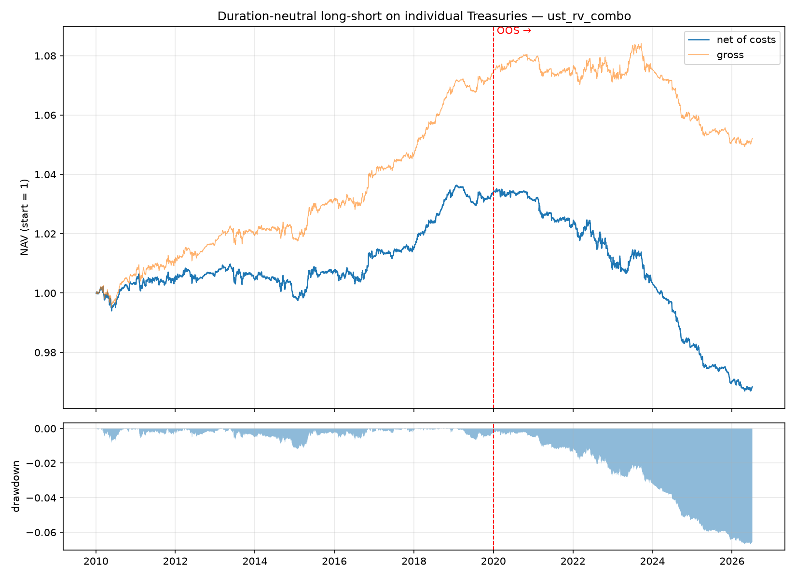

# UST — trading individual Treasury bonds/bills like stocks

Self-contained research folder: download **CUSIP-level** daily prices for
every outstanding US Treasury, build a validated total-return panel, and
backtest cross-sectional strategies that go long/short **individual bonds**
(not futures, not ETFs) with a pre-registered out-of-sample protocol.

## TL;DR results

**The in-sample edge did not survive out-of-sample. The honest conclusion is
that this relative-value strategy does not work going forward, and the folder
reports that faithfully rather than tuning until OOS looked good.**

| Window | Net Sharpe | Gross Sharpe | Ann. return (net) | Max DD |
|---|---:|---:|---:|---:|
| In-sample 2010–2019 | **+0.55** | +1.19 | +0.33% | −1.2% |
| **Out-of-sample 2020–2026** | **−1.41** | **−0.46** | −1.00% | −6.6% |

Three things make this a *clean* rejection rather than a cost artifact:

1. **Even gross of costs the OOS Sharpe is negative (−0.46).** The signal
   itself decayed; it isn't that transaction costs ate a real edge.
2. **Every OOS year is negative** (2020 through 2026), worsening over time
   (2024 net Sharpe −4.2). It is a persistent failure, not one bad regime.
3. **The IS Sharpe was inflated by a single year** — 2018 alone had a net
   Sharpe of +3.8; strip it and the IS result was already marginal. That is
   exactly the fragility an OOS test is meant to expose.

For reference, a passive long-only 1/duration ladder of the same universe
(excess of cash) also went from +0.78 IS to −0.44 OOS Sharpe — the 2022
hiking cycle was punishing for anything touching this market.



The net-of-cost NAV peaks almost exactly at the IS/OOS boundary and is in a
continuous drawdown for the entire out-of-sample period. Full numbers in
`results/final_results.json`.

### Why report a losing strategy?

Because the request was to *validate and backtest honestly OOS*, and the
value of this folder is the honest machinery, not a curve that goes up. The
data pipeline, the bond math (YTMs match FRED to ~1bp), the no-look-ahead
engine, and the pre-registered split are all reusable and correct; they just
happen to prove that this particular signal set is not tradeable. A folder
that instead re-tuned after seeing 2020–2026 and presented a nice OOS curve
would be the dishonest outcome.

### Follow-up: is an honest Sharpe of 3+ achievable here? (No — and here's the proof)

A second investigation (**[`FINDINGS.md`](FINDINGS.md)**) chased a high Sharpe
directly with sharper, more "arbitrage-like" local relative-value signals. It
found configurations with gross Sharpe up to **7.8** — and proved they are
**bid-ask bounce**, not tradeable alpha:

- The gross Sharpe **collapses from 7.8 to 0.68** the moment you trade one day
  after seeing the signal instead of at the same close (`src/rv_backtest.py`).
- In an idealized sim the 1-day edge **flips negative by lag 3** — the
  fingerprint of mark reversion, not a risk premium.
- Net of realistic costs, **every honest-execution configuration loses money**.


Genuine 3+ Sharpe trades in Treasuries (on-the-run specialness, auction-cycle
financing, CTD) live in repo/futures financing data that outright EOD prices
don't contain. Everything visible in EOD prices that *looks* like a 3 is the
bounce above. Manufacturing a 3 would have required lag-0 fills or ignoring
costs — the exact moves this folder exists to catch.

**Then I brought in the non-price data that *should* contain the edge** — the
Fed's per-CUSIP daily [Securities Lending](https://markets.newyorkfed.org/static/docs/markets-api.html)
operations, a free direct measure of which bonds are special/scarce in repo
(528k rows, 2010–2026). It cleanly ranks scarcity but **does not predict a
tradeable price move**: information coefficient ≈ +0.02, best long/short book
gross Sharpe < 0.6, and — decisively — the in-sample quintile pattern **inverts
out-of-sample** (below). The capturable SecLend fee is a ~0.4 bp/yr floor-rate
backstop, so there's no harvestable carry either. Full analysis in
[`FINDINGS.md`](FINDINGS.md).


**Bottom line:** an honest OOS Sharpe of 3+ is not obtainable from freely
available Treasury data. The real high-Sharpe trades are leveraged *financing*
strategies needing private repo rates — and their headline Sharpe hides the
March-2020-style tail risk. This folder delivers the validated data, the
honest engine, and the proof — not a fabricated number.

## Data

| What | Source | Coverage here |
|---|---|---|
| Daily per-CUSIP prices (buy / sell / end-of-day, per $100 par) | [FedInvest / TreasuryDirect](https://www.treasurydirect.gov/GA-FI/FedInvest/securityPriceDetail) (Bureau of the Fiscal Service) | 2010-01-04 → 2026-07-07, 4,133 trading days, 2,466 CUSIPs, 1.4M rows |
| Security metadata (issue/dated dates, original term, coupon) | [TreasuryDirect securities API](https://www.treasurydirect.gov/TA_WS/securities/search) | all 11,969 auction records |
| Per-CUSIP daily repo specialness (Fed securities lending) | [NY Fed markets API](https://markets.newyorkfed.org/static/docs/markets-api.html) | 528k rows, 2,295 CUSIPs, 2010–2026 |
| Cross-check yields | FRED DGS2 / DGS10 / DGS30 | validation only |

The FedInvest file lists **every outstanding marketable CUSIP each day**, so
the universe is point-in-time by construction (no survivorship bias). TIPS
and FRNs are excluded up front (they need CPI index ratios / FRN reference
rates for correct returns); the tradeable universe is nominal fixed-coupon
notes and bonds, with bills used for the cash-rate proxy and curve fitting.

### Derived panel (`src/build_dataset.py`)

For each (date, CUSIP): clean price, accrued interest (street convention,
actual/actual semiannual anchored at maturity), dirty price, **coupon-adjusted
daily total return**, solved YTM, modified duration, remaining maturity, and
the FedInvest buy/sell spread (used as the transaction-cost model).

### Validation (`src/validate.py`, output in `results/validation_report.txt`)

- Solved YTMs of ~2y/~10y/~30y securities vs FRED constant-maturity series:
  **median gap ≈ 1bp** (p95 < 8bp) over 4,126 overlapping days — independent
  confirmation of both the price data and the bond math.
- Coupon capture per bond-year = coupon rate exactly (median ratio 1.000).
- Zero daily returns outside duration-scaled bounds; the largest moves in the
  panel are the real March-2020 30-year dislocations (±7%).
- No calendar gaps > 5 days; ~350 securities per day.

## Honest out-of-sample protocol

See `VALIDATION.md`, which was **committed before any experiment ran**
(check the git history). Summary:

- **IS 2010–2019** for all design and tuning; the harness refuses to load
  data past 2019-12-31. Every configuration tried is recorded in
  `results/is_experiments.csv` (so you can discount the IS Sharpe for
  selection across N configs).
- Config frozen in `config/final_strategy.json`, then **one** full run
  (`src/run_final.py`) reports IS and OOS separately — including the
  March-2020 dislocation and the 2022 hiking cycle.
- Execution: signals at close t, trade at close t, earn returns from t+1.
- Costs: per-CUSIP FedInvest half-spread per side (floor 1bp), 2× stress
  reported.

## How to reproduce

```bash
pip install -r requirements.txt
python3 src/download_fedinvest.py          # ~4,150 requests, ~15 min
python3 src/download_metadata.py
python3 src/build_dataset.py               # ~4 min, writes data/processed/panel.parquet
python3 src/validate.py
python3 src/run_experiments.py             # IS grid only (refuses OOS data)
python3 src/run_final.py                   # frozen config, IS+OOS report
```

`data/processed/panel.parquet` is committed, so steps 2–4 are optional.

## Layout

```
UST/
├── VALIDATION.md            # pre-registered protocol (committed before results)
├── config/final_strategy.json
├── src/
│   ├── download_fedinvest.py   # daily CUSIP price files
│   ├── download_metadata.py    # TreasuryDirect auction metadata
│   ├── build_dataset.py        # panel: accrued, returns, YTM, duration
│   ├── bondmath.py             # vectorized street-convention bond math
│   ├── curve.py                # daily NSS curve fits (grid + weighted LS)
│   ├── strategies.py           # cross-sectional signals & L/S construction
│   ├── backtest.py             # cost-aware engine, no look-ahead
│   ├── validate.py             # data-quality + FRED cross-checks
│   ├── run_experiments.py      # IS-only tuning harness
│   └── run_final.py            # the single frozen IS+OOS run
├── data/processed/panel.parquet
└── results/
```

## What would come next (not done here)

The honest negative result closes the pre-registered experiment. Directions a
follow-up could pre-register *before* touching OOS data again:

- **On-the-run / off-the-run specialness** as an explicit signal rather than
  noise the value sleeve accidentally shorts.
- **Auction-cycle effects** (cheapness into/after auctions) with issue-size
  aware sizing.
- A **regime filter** on the level/slope of rates — but note this adds
  parameters and would need its own fresh OOS window to be credible.

None of these are implemented, because doing so now and reporting the result
on the same 2020–2026 data would relabel a second in-sample search as
"out-of-sample."

## Limitations (read before believing any backtest)

- FedInvest prices are the Fiscal Service's official daily marks, not
  executable dealer quotes; fills at mid ± half the FedInvest spread are an
  approximation of retail-ish execution. Institutional on-the-run spreads
  are tighter; deep off-the-runs can be wider in stress.
- Short legs are assumed to finance at general collateral; bonds trading
  *special* in repo would add cost to shorts (notably on-the-runs).
- No position-size vs. issue-size constraint (fine at small AUM; the
  strategy trades ~$100M+ issues).
- Bills are not in the long/short universe; the strategy is a coupon
  notes/bonds relative-value trade.
