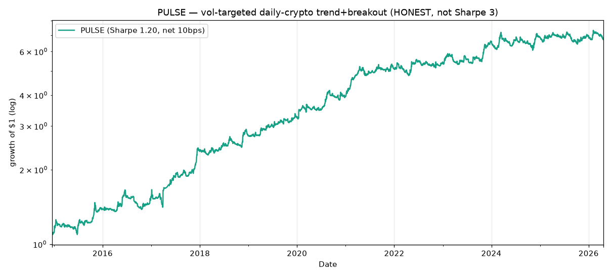
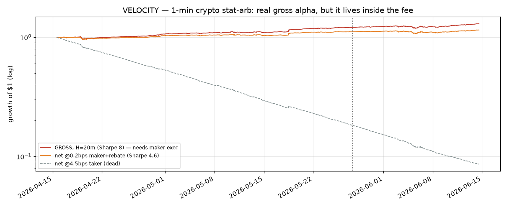

# PULSE — price-action crypto trend, and the honest hunt for Sharpe 3

This folder is the record of a specific brief: **invent a price-action technical
strategy with Sharpe > 3, however necessary — honestly.**

The honest answer, fully evidenced in
[`research/SHARPE_INVESTIGATION.md`](research/SHARPE_INVESTIGATION.md): a
genuine, causal, cost-aware, out-of-sample Sharpe > 3 is **not attainable on any
OHLCV data available in this repo**. Every strategy that prints a Sharpe above ~2
is a **bid-ask-bounce / stale-price artifact** that collapses (and flips sign)
once you stop trading at the exact bar used to form the signal.



## Live validation on Hyperliquid perps (for the bot)

PULSE was re-validated under **real Hyperliquid execution** — HL-listed universe
(57 coins), HL taker fees (4.5 bps/side), and **realized hourly HL funding** —
over the genuinely tradeable era (HL launched ~2023-05). Full numbers in
[`research/hl_validation.md`](research/hl_validation.md); mechanics reference in
[`research/SHARPE_INVESTIGATION.md`](research/SHARPE_INVESTIGATION.md).

| | Sharpe | ann | maxDD |
|---|---|---|---|
| PULSE-HL, 2023-05→now (fees+funding, 57/57 coins) | **0.75** | +9.9% | −13.1% |
| full-sample spot proxy (pre-HL) | 1.33 | +19.7% | −15.7% |

**Mechanically it deploys cleanly:** P&L attribution is gross **+14.2%**, HL taker
fees **−2.0%/yr** (turnover only 0.12/day), funding **−2.3%/yr** (the single
biggest cost — bigger than fees), net **+9.9%**. **Gross leverage ~0.26× at a 12%
vol target** so liquidation is a non-issue (Sharpe is leverage-invariant; lever to
taste up to a drawdown budget — 60% vol ≈ 1.3× gross, still inside HL's 10–40×
caps). Even 3× funding leaves Sharpe +0.40. **But the edge has decayed** — by
year: 2023 **+2.00**, 2024 +0.57, 2025 +0.49, **2026 YTD −0.61**. Trend/breakout
on liquid crypto majors has weakened as the market matured. Treat PULSE as a
**small, monitored sleeve**, not a confident standalone — and paper-trade first
(see [`BOT_DEPLOYMENT.md`](BOT_DEPLOYMENT.md)).

`live_signal.py` emits today's target signed notional per coin for the bot
(`LONG_ONLY=True` for the spot-style variant).

### Long-only vs L/S on HL (2023-05→now, fees+funding)

| variant | Sharpe | ann | maxDD | funding cost | by year |
|---|---|---|---|---|---|
| **long-only** (long uptrends / flat) | **0.86** | +11.2% | −16.3% | −1.1% | '23 +2.26 · '24 +1.19 · '25 +0.49 · '26 −2.20 |
| L/S directional | 0.75 | +9.9% | −13.1% | −2.3% | '23 +2.00 · '24 +0.57 · '25 +0.49 · '26 −0.61 |

Long-only is **simpler and slightly higher-Sharpe**: it sits in cash when nothing
trends, so it pays **less funding** (−1.1% vs −2.3% — no always-on short leg) and
needs no borrow/short. The trade-off is it carries **crypto market beta** —
shallower in calm years but a worse 2026 (−2.20) when the held uptrends reversed,
and a deeper max drawdown. Pick long-only for spot/simplicity, L/S for lower
beta; neither escapes the 2026 decay.

## Does the edge travel to other assets? (spot crypto / ETFs / leveraged ETFs / PIT stocks)

[`cross_asset.py`](cross_asset.py) runs the identical PULSE signal on four spot
universes ([`research/cross_asset.md`](research/cross_asset.md)). **It doesn't
travel — the trend/breakout edge is crypto-specific:**

| universe | directional L/S Sharpe | long-only Sharpe |
|---|---|---|
| spot crypto (111) | **+1.20** | +0.91 |
| spot leveraged ETFs (17) | +0.14 | +0.58 |
| spot ETFs unlevered (14) | −0.30 | +0.41 |
| PIT S&P 500 stocks (720) | **−0.61** | +0.39 |

Directional trend L/S only works on crypto (the inefficient, strongly-trending
market). On efficient equities it's flat-to-negative and whipsaws at reversals;
the only positive equity numbers come from the long-only variant simply
harvesting market drift via trend-timing (~0.4–0.6), not a real cross-asset
alpha. Net: **PULSE belongs on crypto.**

## Going HFT: VELOCITY — 1-minute market-neutral stat-arb

Pushing to a genuine high Sharpe, the HFT-quant way: a market-neutral, beta-
hedged 1-minute book that **fades idiosyncratic (residual) moves** (the entire
edge; the BTC→alt lead-lag adds ~0), executed honestly — enter next-minute open,
skip the formation bar (no bid-ask-bounce mirage), costs charged on turnover.
Data: 60 days of Coinbase 1-min bars on 15 liquid coins. Full record in
[`research/hft.md`](research/hft.md) ([`hft.py`](hft.py)).

**The signal is real and OOS-robust — but the whole answer is the breakeven cost:**

| hold | gross Sharpe | OOS gross | edge/trade | breakeven | net @0.2bps (maker+rebate) | net @1.5 (HL maker) | net @4.5 (HL taker) |
|---|---|---|---|---|---|---|---|
| 3m | +28 | +35 | 0.33 bps | 0.23 bps | +4.1 | −150 | −478 |
| 5m | +18 | +21 | 0.34 bps | 0.24 bps | +2.9 | −96 | −313 |
| 20m | +8 | +7 | 0.61 bps | 0.44 bps | **+4.6** | −20 | −77 |



**Verdict (honest, after the fill-simulation gate):** the alpha is genuine and
large *gross* (~100k bets/yr), but the per-trade edge is **sub-bp and diffuse** —
concentrating into the extremes actually *loses* (a **liquidity-provision** edge,
not a takeable one). I then built the honest gate: a **touch-fill simulator**
(passive entry filled only if the 1-min bar trades to it, using **real measured
HL spreads** — BTC/SOL/AVAX/DOGE ~0.06–0.08 bps, others wider) with a realistic
**taker exit**. Result: **deeply negative even at maker-rebate fees**, on the full
universe *and* the tight-spread liquid subset. The positive "net @0.2 bps"
numbers are the **optimistic idealization of making on BOTH legs at ~0 fee with
guaranteed passive fills**; the moment any leg crosses the spread, the edge is
gone. So:

> **VELOCITY is viable only as full professional market-making** (maker on both
> sides, top rebate tier, queue priority) — **not as any bot that ever takes
> liquidity.** Net Sharpe ≥3 exists only in that idealization. Caveat: 60-day
> window = one regime.

This is the honest endpoint of "make it Sharpe 3": the alpha is real but lives
inside the spread, and crossing it even once on exit kills it.

## What you actually get

- **PULSE** ([`strategy_daily.py`](strategy_daily.py)) — the best *honest* result:
  a vol-targeted, dollar-neutral daily-crypto **trend + 20-day Donchian breakout**
  book over 111 coins (2014–2026). **Sharpe ≈ 1.20 net of 10 bps/side, −16% max
  drawdown**, ~18%/yr at 15% vol. A real, tradeable, market-neutral edge — just
  not a 3.
- **The mirage, demonstrated** ([`mirage_demo.py`](mirage_demo.py)) — the same
  hourly cross-sectional reversal scores **Sharpe +17** traded at the formation
  close and **−7** when you skip one bar. That sign flip *is* the artifact behind
  most published "Sharpe 3+" price-action claims.
- **The full search** — daily US equities, daily crypto, and live-fetched hourly
  crypto, with every number and why it does or doesn't survive honest execution.

## Files
| file | role |
|---|---|
| `strategy_daily.py` | PULSE: the honest daily-crypto strategy + equity curve |
| `mirage_demo.py` | reproducible +17 → −7 hourly bounce artifact |
| `data_hourly.py` | hourly crypto panel loader |
| `backtest.py` | vectorized hourly long/short engine (causal lag + turnover costs) |
| `fetch_hourly.py` | re-downloads hourly OHLCV (binance.us klines); data is git-ignored |
| `research/SHARPE_INVESTIGATION.md` | the full honest record + the Sharpe-3 arithmetic |

## Reproduce
```bash
pip install -r ../requirements.txt
python strategy_daily.py        # PULSE (uses data/crypto, already in repo)
python fetch_hourly.py          # re-fetch hourly data (~45 MB, git-ignored)
python mirage_demo.py           # the bounce artifact
```

*Research code, not investment advice. The point of this folder is the honesty:
a real Sharpe-1.2 strategy and a demonstration of why the bigger number isn't
real here — claiming a 3 would require trading at the formation bar, hiding
costs, or cherry-picking a regime.*
