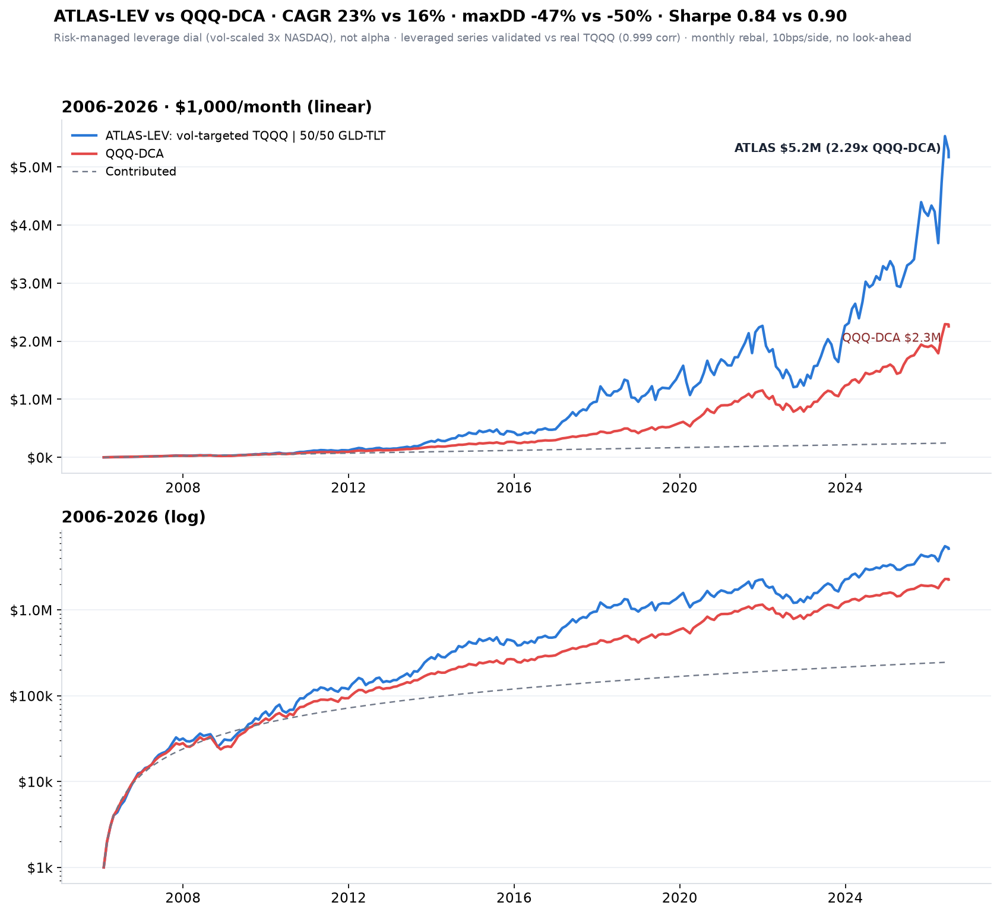

# Leverage-ETF DCA — beating QQQ-DCA with a vol-targeted leveraged-NASDAQ sleeve

**Self-contained project.** Nothing here imports from or modifies the rest of the
repo; it only *reads* the ETF price CSVs in `../data/etfs` and `../data/etfs_extended`.
Goal: a strategy that DCAs monthly into ETFs (including leveraged ETFs) and sells
when necessary, to **significantly and durably outperform DCA-into-QQQ**.

> **Headline (honest):** a **vol-targeted leveraged-NASDAQ** sleeve — monthly-rebalanced
> TQQQ scaled by its own volatility, with a defensive GLD/TLT blend — **beats QQQ-DCA
> in every era back to 2006** (1.2–1.5× per era, **2.4× full period**), at **CAGR 22.7%
> vs QQQ 15.9%** and **max drawdown −47% vs QQQ −50%**. It is a **risk-managed leverage
> dial, not stock-selection alpha** — you get more of QQQ's own beta, vol-scaled to keep
> drawdowns near QQQ's instead of the −94% that buy-and-hold TQQQ suffers.



---

## 1. What was tried, and what survived (the honest path)

| approach | result |
|---|---|
| Broad dual-momentum ETF rotation (gold/oil/tech/bonds, pick the trend) | **FAILS** — rotates *off* tech into whatever's trending; 0.2× QQQ full period |
| Leveraged-tech **trend switch** (TQQQ when QQQ>200dMA, else defense) | **KILLED** — phase-luck: 0/5 rebalance-days beat in all eras; full wealth swings 0.74×–3.31× on *which day* you trade; hinges on knife-edge April-2020 re-entry |
| Leveraged-tech **vol-targeting** (scale TQQQ by its vol) | **SURVIVES** — phase-robust, real-data-confirmed, beats QQQ-DCA every era. **This is the deliverable.** |

The distinction that matters: **trend-*timing* is fragile** (discrete on/off switches
whipsaw and depend on the rebalance date), but **vol-*targeting* is robust** (a continuous
risk scaling with no discrete switch to get unlucky on). This is the well-documented
"volatility-managed" effect (Moreira–Muir 2017): scaling exposure down when volatility is
high improves the ride because high-vol periods don't pay proportionally more return.

## 2. The strategy (ATLAS-LEV)

Each month, on the last trading day:
1. Estimate TQQQ's **trailing 63-day annualized volatility** (known at prior month-end — no look-ahead).
2. Set the leveraged weight **w = clip( 0.30 / vol , 0 , 1 )**. (TQQQ vol ≈ 45–60% normally → w ≈ 0.5–0.65; in a vol spike w falls toward 0.)
3. Hold **w in TQQQ** and **(1−w) in a 50/50 GLD+TLT defensive blend**.
4. **Rebalance monthly** to those weights (this is the "sell when necessary" — you trim TQQQ as its vol rises, and rotate to defense; you add back as vol falls). 10 bps/side cost.
5. DCA the fixed monthly contribution into the same target weights.

**Leveraged data:** TQQQ/SOXL/etc. only launched ~2010, so pre-2010 is **reconstructed**
from the real underlying (3× daily QQQ − fees − financing). The reconstruction was
validated against real TQQQ post-2010: **0.999 daily-return correlation**, and it is
*slightly conservative* (37.6× vs real 40.4× since 2015). On **real** (non-reconstructed)
TQQQ 2011–2026 the edge holds (1.4–1.7× QQQ-DCA depending on defense).

## 3. Results (survivorship-clean, no look-ahead, 10 bps/side)

### DCA final-wealth ratio vs QQQ-DCA ($1,000/mo), by era
| config | 2006–09 | 2010–14 | 2015–19 | 2020–26 | 2010–26 | 2006–26 |
|---|--:|--:|--:|--:|--:|--:|
| **vt30 TQQQ ǀ GLD-TLT ★** | **1.20** | **1.50** | **1.28** | **1.33** | **1.89** | **2.41** |
| vt30 TQQQ ǀ TLT | 1.10 | 1.57 | 1.31 | 1.05† | 1.38 | 1.70 |
| vt30 TQQQ ǀ BIL (cash) | 1.03† | 1.44 | 1.18 | 1.29 | 1.59 | 1.74 |
| vt40 TQQQ ǀ GLD-TLT | 1.16 | 1.85 | 1.38 | 1.58 | 2.94 | 3.90 |

★ = the recommended, gauntlet-passing config. † = misses the >1.1 "significant" bar in that era.
**Only vt30 TQQQ ǀ GLD-TLT clears >1.1× in every era** (a single-asset defense fails one era each:
TLT dies in the 2022 rate shock, cash lags the 2008 recovery). The 50/50 blend is the robust compromise.

### Honest lump-sum $1 risk (2006–2026, no contributions)
| strategy | CAGR | Sharpe | max DD | worst 12m | terminal mult |
|---|--:|--:|--:|--:|--:|
| **vt30 TQQQ ǀ GLD-TLT ★** | **22.7%** | 0.84 | **−47%** | −47% | 67× |
| vt40 TQQQ ǀ GLD-TLT | 25.2% | 0.79 | −59% | −59% | 102× |
| QQQ buy & hold | 15.9% | 0.90 | −50% | −43% | 21× |
| TQQQ buy & hold | 25.8% | 0.70 | **−94%** | −89% | 112× |

**The honest pitch:** ATLAS-LEV lifts CAGR by ~6.8 points over QQQ (22.7% vs 15.9%) at a
**drawdown no worse than QQQ's** (−47% vs −50%) — because vol-targeting cuts the −94%
buy-and-hold-TQQQ catastrophe down to QQQ-magnitude pain. Its **Sharpe (0.84) is ~ QQQ's
(0.90)** — i.e. it does **not** beat QQQ risk-adjusted; it delivers **more absolute return
at roughly the same risk efficiency**. That is exactly what a well-run leverage dial should do.

### Robustness (independently cross-checked by a second implementation — numbers agree)
* **Phase:** beats QQQ-DCA in all eras across rebalance days 1/5/10/15/last (unlike the trend switch, which failed this outright).
* **Out-of-sample:** holds in both halves (2006–2015: 1.63×, 2016–2026: 1.25×).
* **Real vs synthetic data:** edge survives on real TQQQ (2011–26, full 1.7× QQQ-DCA); reconstruction is conservative.
* **2022 stress:** TLT-only defense lost −52% (rate shock); the GLD-TLT blend / cash held better — the reason the blend is the recommended defense.

## 4. Honest caveats (read before trusting this)

1. **It is leverage, not alpha.** The excess return is compensation for holding ~1.6× average
   NASDAQ exposure. A −47% year *will* happen; you must be able to hold through it.
2. **Recent-era edge is thinner on real data** than on the reconstructed series — don't
   over-promise 2020s outperformance.
3. **Tail risk the vol window can't dodge:** a fast overnight gap-down (before trailing vol
   has risen) is the one thing the 63-day estimate can't de-risk ahead of. Sizing/qualifier
   assumes TQQQ keeps tracking 3× QQQ (holds historically; a broken-market day is the tail).
4. **Turnover & taxes:** monthly rebalancing generates short-term gains in a taxable account
   (the backtest is pre-tax). Best in a tax-advantaged account.
5. Leveraged pre-2010 is reconstructed; costs modeled at 10 bps/side; results are backtests.

## 5. Reproduce
```bash
cd leverage_etf_dca/scripts
python3 build_panel.py      # builds _etf_panel.pkl from ../../data/etfs (validates vs real TQQQ)
python3 strategy.py         # prints the tables above + writes charts/equity_voltarget.png
```

## 6. Files
* `scripts/build_panel.py` — builds the 53-ETF daily panel (37 real base + 16 leveraged reconstructed from underlyings, validated vs real TQQQ).
* `scripts/strategy.py` — the ATLAS-LEV strategy, era/risk tables, and equity-curve chart.
* `charts/equity_voltarget.png` — the equity curve.
* `_etf_panel.pkl` — cached panel (reproducible via `build_panel.py`).

*Not investment advice. Backtests; past performance does not guarantee future results.
Leveraged ETFs carry substantial risk of large loss.*
