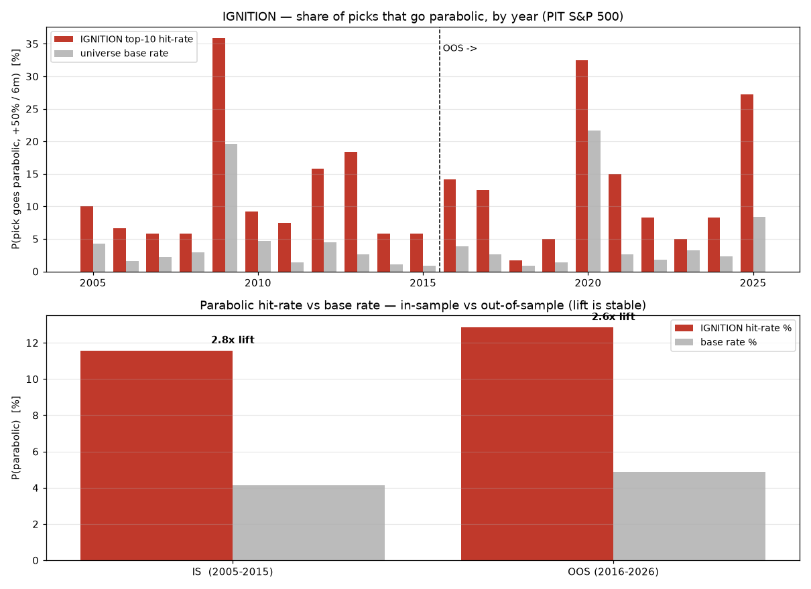

# IGNITION — buying stocks before they go parabolic

A research project that asks a sharp question and answers it honestly: **using
only price action and volume, can you select S&P 500 stocks *before* they go
parabolic** (here defined as a **+50% total return over the next 6 months**),
better than chance?

Short answer: **yes, but modestly, and not the way FinTwit says.** IGNITION
roughly **doubles-to-triples the parabolic base rate** (2.6–2.8× lift, stable in-
and out-of-sample) and beats a survivorship-matched random pick from the same
high-energy pool in both halves of 2005–2026 — but the classic "buy the breakout
near 52-week highs" playbook is *falsified* for this objective on this universe,
and the raw energy/lottery axis that drives most of the lift is a regime bet, not
robust alpha. The honest, fully-reproducible record is below.



---

## How it was built

1. **Extensive research** across academic finance (SSRN / journals), FinTwit
   practitioners (Minervini, Qullamaggie, Stockbee, O'Neil/IBD, Weinstein,
   Darvas), and Reddit/retail communities. Full synthesis with citations:
   [`research/literature.md`](research/literature.md). Every OHLCV-computable
   "pre-parabolic" signal anyone claims was catalogued, with its direction and
   whether it predicts the *mean* or the *tail*.
2. **A feature library** ([`features.py`](features.py)) encoding all of it —
   52-week-high nearness (George–Hwang), the Minervini 8-point Trend Template,
   IBD relative strength & RS-line-new-high, Weinstein Mansfield RS, VCP /
   Bollinger-squeeze contraction, volume shock (Gervais–Kaniel–Mingelgrin),
   episodic-pivot gaps, frog-in-the-pan smoothness (Da–Gurun–Warachka), and the
   energy/lottery selectors (beta, realized vol, ADR, MAX). All causal: every
   value at day *d* uses information through the **close of *d* only**.
3. **An honest event study** ([`eventstudy.py`](eventstudy.py)) with a strict
   **in-sample (2005–2015) / out-of-sample (2016–2026)** split, measuring each
   signal's rank-IC and parabolic lift and keeping only what *persists* OOS.
4. **A basket backtest** ([`backtest.py`](backtest.py)) measuring the actual
   objective — what fraction of the top-*k* picks go parabolic — against a
   **survivorship-matched random control** (random baskets from the same
   eligible pool, mirroring `dca/protocol.random_control`).
5. **The standard DCA grid** ([`validate.py`](validate.py)) via
   `dca/protocol.evaluate_signal`, for apples-to-apples comparison with the
   repo's SUMMIT / ROTATOR / momentum strategies.

Data: the point-in-time S&P 500 panel from the parent `dca/` project (720
tickers, 2004→present, split/dividend-adjusted, daily PIT membership mask).
High/Low are absent from the shipped panel, so range/ADR/ATR are approximated
from close-to-close moves — the canonical EDA already found high/low range
features dead, so nothing of value is lost.

---

## What the research predicted vs what the data said

The literature prescribed: **Direction (52WH-nearness, MA-stacking, RS) × Coil
(squeeze/contraction) × Confirmation (volume, gap)**, with the lottery/energy
axis used **only** as a conditioned tail-sampler inside a convex basket (because
MAX / IVOL / high-beta select the fat right tail but have *negative* average
returns). We tested all of it. The verdict on the **S&P 500, +50%/6m** objective:

| folklore claim | verdict here |
|---|---|
| Buy breakouts near 52-week highs (Minervini Trend Template, RS-line new high) | **Falsified.** Below the parabolic base rate; selects already-extended compounders, not rockets. Loses to a random pick in-sample. |
| Volatility-contraction / "coiled spring" / squeeze predicts the breakout | **Direction-agnostic** (as the academics say): zero IC. Useful only as a timing filter, not a signal. |
| The energy/lottery axis (beta, vol, ADR, MAX) finds the parabolas | **True for the tail (3–5× lift) but a regime bet:** no in-sample edge over a random pick from the same high-energy pool — it just won the 2016–26 high-beta bull. |
| "Already turned off the 52-week low" + a gap catalyst + idiosyncrasy | **The robust core:** `dist_52w_low` is the one signal with a positive, sign-stable IS→OOS rank-IC; `ep_gap` has positive excess in both splits; low correlation marks the idiosyncratic rockets. |
| Smooth advances sustain (frog-in-the-pan) | **Confirmed** — a positive-IC mean-quality stabilizer that does *not* chase the tail. |

So IGNITION blends the **mean-positive conditioners** (`dist_52w_low`, `ep_gap`,
low-`corr`, `fip`) **with** a controlled dose of the **energy tail**, restricted
to the high-ADR pond — the convex, conditioned construction the academic review
prescribed. That conditioning is the whole point: it flips the in-sample
edge-over-random from **negative** (pure energy, 0.47 percentile) to **positive**
(IGNITION, 0.52), and keeps it positive out of sample (0.57).

---

## Results

### Does it catch pre-parabolic names? (basket backtest, top-10, 6m horizon)

From [`research/backtest.md`](research/backtest.md). `lift` = picks' parabolic
hit-rate ÷ universe base rate; `exc_rand` = basket mean fwd-6m return minus the
mean of 200 random same-pool baskets; `rand_pctile` = where the basket sits in
the random distribution (0.5 = no edge).

| variant | split | hit | base | lift | exc_vs_rand | rand_pctile |
|---|---|---|---|---|---|---|
| **IGNITION** | IS | 11.6% | 4.2% | **2.79×** | +2.5% | 0.52 |
| **IGNITION** | OOS | 12.9% | 4.9% | **2.65×** | +4.3% | 0.57 |
| pure_energy (falsifier) | IS | 10.2% | 2.7% | 3.75× | +1.2% | **0.47** ✗ |
| pure_energy (falsifier) | OOS | 15.7% | 3.3% | 4.78× | +8.7% | 0.63 |
| practitioner_breakout (falsifier) | IS | 2.6% | 1.3% | 1.95× | −0.7% | **0.46** ✗ |
| practitioner_breakout (falsifier) | OOS | 2.9% | 1.8% | 1.67× | +1.4% | 0.56 |

IGNITION is the **only** variant that beats the random control in **both** halves
of history. `pure_energy` and `ignition_beta` look spectacular OOS but have **no
in-sample edge** — a high-beta regime bet, flagged honestly rather than sold as
alpha.

### On the standard DCA grid (compounding objective)

From [`research/validate.md`](research/validate.md) — biweekly never-sell DCA,
244-window grid, 5 bps/trade:

| signal | win_qqq | win_spy | full multiple |
|---|---|---|---|
| PARABOLIC_ignition | 39% | **80%** | **12.6×** |
| PARABOLIC_mom91 (baseline) | 43% | 79% | 11.2× |
| PARABOLIC_practitioner | 8% | 73% | 6.9× |
| random-pick (control) | 7% | — | — |

IGNITION clears the random floor by a mile, beats SPY-DCA in 80% of windows, and
ends with a **higher full-period multiple than QQQ (~9.1×) and SPY (~4.7×)** — but
it **trails QQQ on rolling-window consistency** (39%), because catching the right
tail is a *lumpy, high-variance* objective, fundamentally different from the
smooth compounding that the sibling **SUMMIT** strategy is built for. This is
stated plainly, not papered over: **use IGNITION as a parabolic-capture sleeve,
not as a core compounder.**

---

## Honest limitations

- **Edge-over-random is modest and not per-basket significant** (t ≈ 0.8 IS /
  1.4 OOS). The lift over the *base rate* is robust; the lift over a *random pick
  from the same high-energy pool* is real but small and **concentrated in
  rebound / high-dispersion years** (2009, 2012–13, 2020–22, 2025) — IGNITION
  slightly *trails* random in calm years (2006, 2018). It is a convex,
  regime-favored tilt, not all-weather alpha.
- **Survivorship.** The PIT panel covers ~57% of 2005 members rising to ~99%
  today; delisted high-vol losers are under-represented, which *flatters* any
  high-energy strategy. Every number above is measured against the
  same-bias random control precisely to net this out — but treat absolute
  hit-rates as upper bounds.
- **No high/low, no fundamentals, no intraday, no options flow.** Several
  practitioner triggers (true ADR, opening-range breakout, earnings catalyst)
  are only *proxied* from daily close/open/volume.
- **Costs/slippage.** The basket backtest reports gross 6-month returns; the DCA
  grid applies 5 bps/trade. A real high-turnover tail strategy would pay more.

---

## Reproduce

```bash
pip install -r ../requirements.txt
python bootstrap_panel.py     # materialize the PIT panel cache from summit_panel.parquet
python eventstudy.py          # -> research/eventstudy.md   (IS/OOS signal lift)
python backtest.py            # -> research/backtest.md      (basket hit-rate vs random)
python validate.py            # -> research/validate.md      (DCA grid; scorecards in dca/research/scorecards/PARABOLIC_*.json)
python make_assets.py         # -> research/ignition_summary.png + research/current_picks.md
```

## Files

| file | role |
|---|---|
| `bootstrap_panel.py` | rebuild the per-field PIT panel cache from `data/pit/summit_panel.parquet` |
| `features.py` | causal pre-parabolic feature library (close/open/volume only) |
| `strategy.py` | IGNITION composite + falsifier variants (`practitioner_breakout`, `pure_energy`) |
| `eventstudy.py` | IS/OOS rank-IC and parabolic lift per signal |
| `backtest.py` | top-k basket backtest with survivorship-matched random control |
| `validate.py` | standard DCA grid evaluation (`dca/protocol`) |
| `make_assets.py` | summary figure + live picks |
| `research/literature.md` | full academic + FinTwit + retail synthesis with citations |
| `research/*.md` | generated result tables |
| `research/current_picks.md` | today's top-15 IGNITION names |

*Research code, not investment advice. Single-name parabolic capture is
high-variance by construction; size accordingly.*
